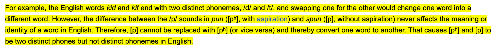
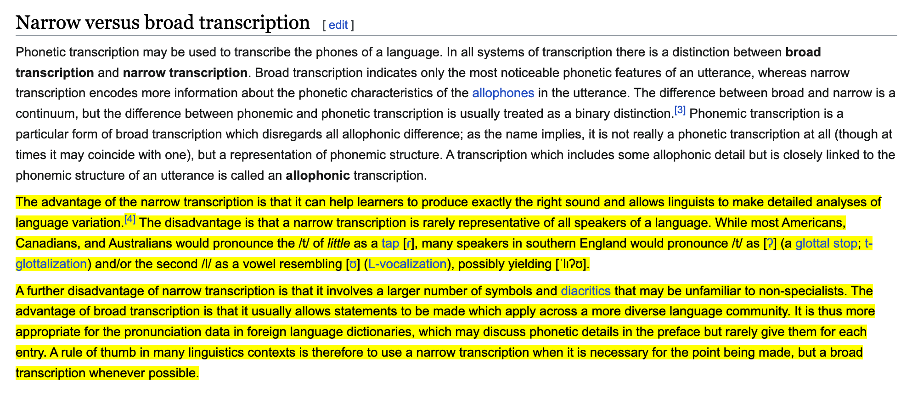
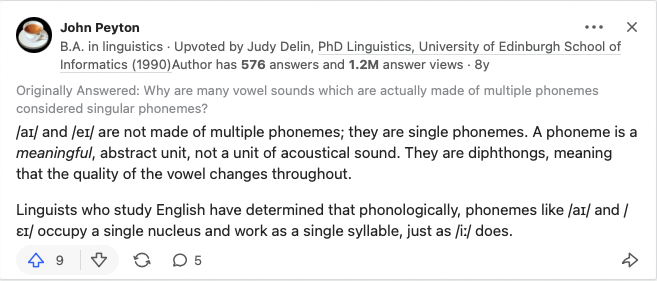

# IPA 是什么，它的作用是什么？

**2023.02.04**

## Transcription

你们小时候上学的时候有没有用过白话文来给英文单词注音过？我记得我学习音标的时候，我发小去上了英文辅导班，回来带了张纸回来，上面用白话文对每一个音都做了标记。

这个将声音用文字的形式记录下来的过程就叫做 **Transcription**（标记）。

那么为什么需要 [Transcription](https://en.wikipedia.org/wiki/Transcription) ? 

那肯定是有用啊，比如音乐中作曲，扒谱，还有词典里的音标，我们就可以用文字的形式记录下这些声音了。

## IPA

我们小时候学的音标就是 IPA，也就是国际音标，国际音标的每一个字母（letter） 对应一个音（distinct speech sound）。

先来看下 IPA 的[定义](https://en.m.wikipedia.org/wiki/International_Phonetic_Alphabet)吧，

> The International Phonetic Alphabet (IPA) is an alphabetic system of phonetic notation based primarily on the Latin script.

它的全称是 _ International Phonetic Alphabet_，是一个主要基于拉丁文的用来表示声音的一个字母表。

它的作用我们刚才也提到了，就是用一个字母（letter）表示一个声音，这样我们就可以用字母来记录声音了。

[维基百科](https://en.m.wikipedia.org/wiki/International_Phonetic_Alphabet)是这样说的，

> The IPA is designed to represent those qualities of speech that are part of lexical (and, to a limited extent, prosodic) sounds in oral language: phones, phonemes, intonation, and the separation of words and syllables.[1] To represent additional qualities of speech—such as tooth gnashing, lisping, and sounds made with a cleft lip and cleft palate—an extended set of symbols may be used.

它是被设计用来表示口语词汇中的发音的这些性质的，_ phones_（音素），_phonemes_（音位），_ intonation_（语调），单词和音节（syllables)间的停顿。

这里我们来讲下 _ phones_（音素），_phonemes_（音位），先来看下这两个单词的意思然后给你举个例子，

根据维基百科的[定义](https://en.wikipedia.org/wiki/Phone_(phonetics))，

> In phonetics and linguistics, a phone is any distinct speech sound or gesture, regardless of whether the exact sound is critical to the meanings of words.

_phone_（音素）是任何清晰（不含糊）的声音或姿势，这个单词具体怎么发音不会影响这个单词的意思。

> In contrast, a phoneme is a speech sound in a given language that, if swapped with another phoneme, could change one word to another. Phones are absolute and are not specific to any language, but phonemes can be discussed only in reference to specific languages.

相反，_ phoneme_（音位）它是给定的语言中的一个声音，如果这个声音换成了别的声音，这个单词的意思就会变掉。_phone_ 的声音是绝对的，是独立于任何语言的，而 _ phoneme_ 只能在特定的语言中才能讨论的。

简单来说，_phone_ 和 _phoneme_ 都用来表示声音，但是有所区别。（对了 phoneme 用 / / 来表示，phone 用 [ ] 来表示声音）。

它举了个例子，

比如，kid(/kɪd/) 和 kit/kɪt/ 就是用两个不同的音位(phoneme) 结尾的，/d/ 和 /t/，如果你将这两个音位互换的话，那么这两个单词的意思就变了。

再举个例子，pun /pʌn/和 spin /spɪn/ 这两个单词，这两个单词里面的 p 的发音是不一样的，pun 的 p 发音是送气的，我们用 [pʰ] 这个 phone（不是电话的意思，是音素的意思） 来表示这个送气音，也就是发音的时候要呼气，而 spin 里面的 p 不是送气的，用 [p] 这个音素表示（phone）。互换这两个单词里的这两个音速的话，单词的意思是不会变的。

所以 [pʰ] 和 [p] 是两个不同的音素，但是 /pʰ/ 和 /p/ 是相同的音位在**英语**中。（音位只能在给定语言中讨论不要忘了各位）

这样我们对音素和音位就有了大致的了解了，在进入下个 case 讨论前，再给你们举个例子，这个是我在知乎上看到的，感觉十分的形象，

在四川话中，/n/, /l/ 是同一个音位(phoneme)，但是在温州话里，这两个词发音是不一样的，是两个不同的音位。

上面提到的用 phone 或者 phoneme 都可以拼写（Transcription）一个单词的音标，用 phone 进行 transcription 的话被称为 narrow transcription，对发音能够进行更精准的描述，用 phoneme 进行 transcription 的话被称为 broad transcription，对发音能够有一个大概的描述。

narrow transcription 的好处是你可以完全 100% 的复原这个单词的发音，但是就是因为过于完全了，所以这也是个坏处，比如上图提到的口音问题，对于 [t] 这个音素（phone）来说，美国的不同地区的人发的音不一样。另一个坏处呢，就是你如果在词典里用音素而不是音位来进行音标标记的话，很多音素大家不认识，或者说不熟悉。从标记上来看，音素其实就是一个音位加上一些变音符（[diascritics](https://en.wikipedia.org/wiki/Diacritic))，所以词典的音标一般采用的是 broad transcription 也就是 phonemic transcrition, 而不是 narrow transcrition 也就是 phonenic transcrition。

看到这里，恭喜你，接下来在看一个我学习的时候遇到的一个 case。

## Case 1

我在学习 IPA 的过程中，无意间查了个单词，_dress_，用的是牛津英汉词典，使用的是 IPA，/dres/，我寻思着，/e/ 不是念 `诶～` 吗？[正常的音标](https://www.oxfordlearnersdictionaries.com/us/definition/english/dress_1?q=dress)应该是 /drɛs/ 才对，觉得很奇怪。

分析，这里用 / / 标记的话，就说明 /e/ 是一个音位（phoneme），

可以看到下图，其实在 IPA 里 dress 里的 e 的发音使用  / ɛ / 这个音位表示的，但是在 OALD 词典里用的是 /e/ 这个音位。

所以我们只要知道就是[历史原因](https://teflpedia.com/Close-mid_front_unrounded_vowel)导致的就行了，但是你应该也看到过了 /eɪ/ 这个音标吧，它怎么念呢，如果这个 /e/ 发的也是 dress 的 e 的发音，那就很奇怪了，比如，face 这个单词，它的音标是 `/feɪs/`，里面的 `/eɪ/` 的发音其实不是 `/e/` + `/ɪ/` 的发音，`/eɪ/` 是一个 phoneme，而 phoneme 的定义就是，两个 phoneme 互相替换的话会改变单词的意思。而且 IPA 的规则是 letter 的发音不会根据上下文而改变的，所以在英语里面我们认为 `/eɪ/` 是一个 phoneme，不过它同时也是一个 diphthong, 也就是一个双元音，在英语里一个 diphthong 是一个 phoneme，而不是两个 phoneme。

对，这样其实就搞定了。牛津词典选择 /e/ 这个 phoneme 作为 dress 里 e 的发音，还不错，这样可以和 face 里的 /eɪ/ 这个 phoneme 区分开。

上面提到了 diphthong，也就是二合元音组合，比如上面的 /eɪ/，在英语里就是一个 diphthong，英语里一个 diphthong 被认为是一个 phoneme。

## Case 2

There’s is no case 2…

## 其他

提一句，苹果自带的 NOAD 词典用的不是 IPA，用的是韦氏音标，

相关的词汇，`phoneme`, `affricate`, `fricative`, `phonetically`, `orthography`, `phone`, `allophone`, `diascritic`, `phonology`, `RP(Received Pronunciation)`。

发现还是从最根本的使用场景出发，然后一个一个剖析这个过程是最方便直观的。

## 参考

1. [IPA consonants number](https://en.wikipedia.org/wiki/IPA_number#100:_IPA_consonants)
2. [IPA pulmonic consonant chart with audio](https://en.wikipedia.org/wiki/IPA_pulmonic_consonant_chart_with_audio)
3. [IPA non-pulmonic consonant chart with audio](https://en.wikipedia.org/wiki/IPA_non-pulmonic_consonant_chart_with_audio)
4. [IPA vowel chart with audio](https://en.wikipedia.org/wiki/IPA_vowel_chart_with_audio)
5. [respelling system](https://en.wikipedia.org/wiki/Pronunciation_respelling_for_English) 
6. [letter dʒ in IPA](https://en.wikipedia.org/wiki/Voiced_postalveolar_affricate)
7. [Romic alphabet](https://en.m.wikipedia.org/wiki/Romic_alphabet)
8. [音素和音位的区别与联系是什么？ - 拙灵的回答 - 知乎](https://www.zhihu.com/question/27250496/answer/36239038)
9. [Phonetic transcription](https://en.wikipedia.org/wiki/Phonetic_transcription)
10. [Why I Don't Love the International Phonetic Alphabet](https://quote.ucsd.edu/phonoloblog/2008/01/04/why-i-dont-love-the-international-phonetic-alphabet/)
11. [Understanding Englsih Pronunciation：Webster's Phonetic Symbols - YouTube](https://youtu.be/JVth80vqQZs)
12. [IPA vs Webster's - YouTube](https://www.youtube.com/watch?v=-ysVFD0buJs)
13. [为什么原版牛津词典的音标和英汉词典的音标不一样？原版的该怎么读？- 知乎](https://www.zhihu.com/question/41843304/answer/92546696)
14. [OALD 在线词典(IPA notion)](https://www.oxfordlearnersdictionaries.com/us/)
15. [OAAD 在线词典(IPA notion)](https://www.oxfordlearnersdictionaries.com/us/definition/american_english)
16. [merriam-webster 在线词典（diacritics notion)](https://www.merriam-webster.com/)
17. [merriam-webster Pronunciation Symbols table with audio - merriam-webster](https://unabridged.merriam-webster.com/info/pronsymbols.html)
18. [DIACRITICAL MARKS](https://spellpundit.com/spellshakti/diacritical-marks/)
19. [韦氏发音 guide pdf](https://merriam-webster.com/assets/mw/static/pdf/help/guide-to-pronunciation.pdf)
20. [What are some examples of monophthongs?](https://qr.ae/pvJYjO)
21. [The Light L /l/ and Dark L ɫ in English](https://youtu.be/ANa8UWr22x0)
22. [Pronunciation exercises: /uː/ vs /ʊ/](https://teflpedia.com/Pronunciation_exercises:_/u%CB%90/_vs_/%CA%8A/)
23. [How do you pronounce 'news'?](https://english.stackexchange.com/questions/25108/how-do-you-pronounce-news)
24. [Yod-dropping - Wikipedia](https://en.wikipedia.org/wiki/Phonological_history_of_English_consonant_clusters#Yod-dropping)
25. [Yod-dropping in American English 讨论](https://forum.wordreference.com/threads/yod-dropping-in-american-english.1316776/)
26. [决定音调的 3 个因素](https://notendur.hi.is/peturk/KENNSLA/02/TOP/VowelSpaceEx.html)
27. [英语教程 101 - notendur](https://notendur.hi.is/peturk/KENNSLA/02/02schedule.html)
28. [Vowel Pronunciation Tutorial • IPA (International Phonetic Alphabet) Vowels  讲解了 vowel chart](https://www.youtube.com/watch?v=tpR5GdKXpGc)
29. [Pronunciation Guide OALD](https://www.oxfordlearnersdictionaries.com/about/pronunciation_english)
30. [English phonology](https://en.wikipedia.org/wiki/English_phonology#Vowels)
31. [韦氏音标 Pronunciation Symbols](https://unabridged.merriam-webster.com/info/pronsymbols.html)
32. [What is International Phonetic Alphabet](https://en.wikipedia.org/wiki/International_Phonetic_Alphabet)
